# 🔍 PowerToys Run: Definition Plugin

<div align="center">
  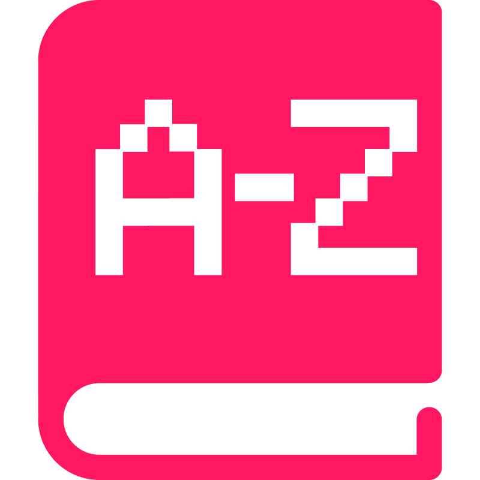
</div>

<div align="center">
  <h1>Definition</h1>
  <p>Lookup word definitions, phonetics, and synonyms directly in PowerToys Run.</p>
  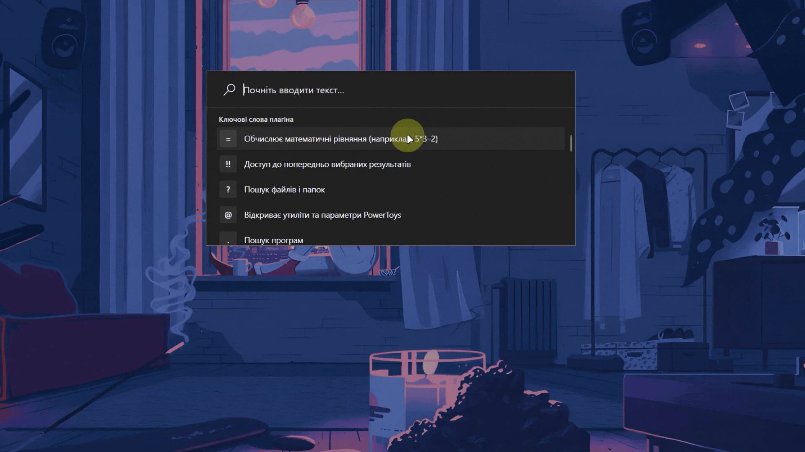
</div>

<div align="center">
  <!-- Badges -->
  <a href="https://github.com/ruslanlap/PowerToysRun-Definition/actions/workflows/build-and-release.yml">
    
  </a>
  <a href="https://github.com/ruslanlap/PowerToysRun-Definition/releases/latest">
    
  </a>
  
  
  
  
  <a href="https://github.com/ruslanlap/PowerToysRun-Definition/stargazers">
    
  </a>
  <a href="https://github.com/ruslanlap/PowerToysRun-Definition/issues">
    
  </a>
  <a href="https://github.com/ruslanlap/PowerToysRun-Definition/releases/latest">
    
  </a>
  
  
  <a href="https://github.com/ruslanlap/PowerToysRun-Definition/releases/latest">
    
  </a>
  
  
  <a href="https://opensource.org/licenses/MIT">
    
  </a>
</div>

<div align="center">
  <a href="https://github.com/ruslanlap/PowerToysRun-Definition/releases/download/v1.0.1/Definition-1.0.1-x64.zip">
    
  </a>
  <a href="https://github.com/ruslanlap/PowerToysRun-Definition/releases/download/v1.0.1/Definition-1.0.1-ARM64.zip">
    
  </a>
  <a href="#-building-from-source">
    
  </a>
</div>

## 📋 Table of Contents

- [📋 Overview](#-overview)
- [✨ Features](#-features)
- [🎬 Demo](#-demo)
- [🚀 Installation](#-installation)
- [🔧 Usage](#-usage)
- [📁 Data Storage](#-data-storage)
- [🛠️ Building from Source](#️-building-from-source)
- [📊 Project Structure](#-project-structure)
- [🤝 Contributing](#-contributing)
- [❓ FAQ](#-faq)
- [🧑‍💻 Tech Stack](#-tech-stack)
- [🌐 Localization](#-localization)
- [📸 Screenshots](#-screenshots)
- [📄 License](#-license)
- [🙏 Acknowledgements](#-acknowledgements)
- [☕ Support](#-support)
- [🆕 What's New (1.0.1)](#-whats-new-v101)

## 📋 Overview

Definition is a plugin for [Microsoft PowerToys Run](https://github.com/microsoft/PowerToys) that allows you to quickly lookup word definitions, phonetics, and synonyms without leaving your keyboard. Simply type `def <word>` to fetch definitions from dictionaryapi.dev.

<div align="center">
  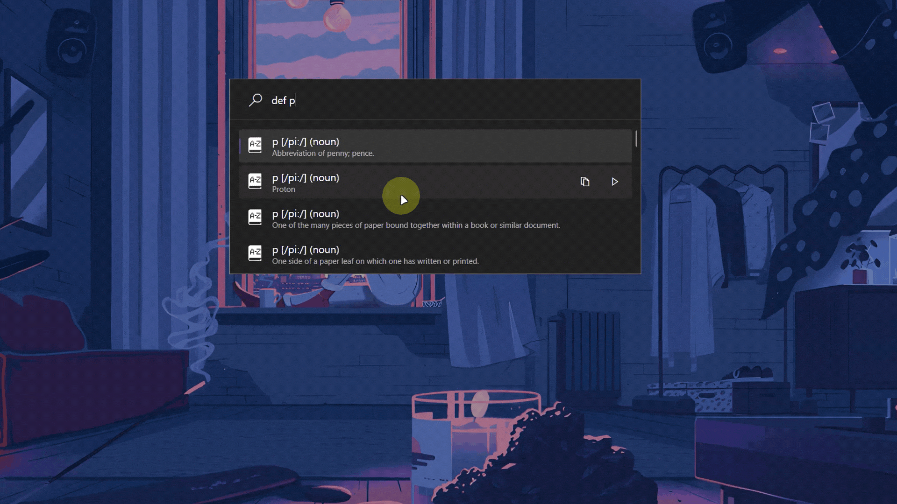
</div>

## ✨ Features

- 🔍 **Instant Definitions**: Get definitions in real-time via `dictionaryapi.dev`.
- 🔊 **Pronunciation Audio**: Play phonetic audio directly from your results.
- 📚 **Phonetics & Synonyms**: View phonetic spelling, synonyms, and antonyms.
- 📝 **Usage Examples**: See real-world examples of how words are used.
- ⏱️ **Delayed Execution**: Shows loading indicator before fetching results.
- 💾 **Caching**: In-memory cache for repeat lookups (up to 100 entries) to improve performance.
- 🌓 **Theme Awareness**: Automatically switches icons for light/dark mode.
- 📋 **Context Menu**: Copy definitions, play pronunciation, open source URL, or search for related words via right-click or keyboard shortcuts.
- 🔄 **Cancellable Requests**: Automatically cancels previous requests when typing new queries.
- 🌐 **Wiktionary Integration**: Open any word in Wiktionary (https://en.wiktionary.org/wiki/{word}) for additional information and translations.

## 🎬 Demo

<div align="center">
  
</div>

## 🚀 Installation

### Prerequisites

- [PowerToys Run](https://github.com/microsoft/PowerToys/releases) installed (v0.70.0 or later)
- Windows 10 (build 22621) or later
- .NET 9.0 Runtime (included with Windows 11 22H2 or later)
- Internet connection (for API access)

### Quick Install

1. Download the appropriate ZIP for your system architecture:
   - [x64 version](https://github.com/ruslanlap/PowerToysRun-Definition/releases/download/v1.0.1/Definition-1.0.1-x64.zip)
   - [ARM64 version](https://github.com/ruslanlap/PowerToysRun-Definition/releases/download/v1.0.1/Definition-1.0.1-ARM64.zip)

2. Extract the ZIP to:
   ```
   %LOCALAPPDATA%\Microsoft\PowerToys\PowerToys Run\Plugins\
   ```
   
   Typical path: `C:\Users\YourUsername\AppData\Local\Microsoft\PowerToys\PowerToys Run\Plugins\`

3. Restart PowerToys (right-click the PowerToys icon in the system tray and select "Restart").

4. Open PowerToys Run (`Alt + Space`) and type `def <word>`.

### Manual Verification

To verify the plugin is correctly installed:

1. Open PowerToys Settings
2. Navigate to PowerToys Run > Plugins
3. Look for "Definition" in the list of plugins
4. Ensure it's enabled (toggle should be ON)

## 🔧 Usage

1. Activate PowerToys Run (`Alt + Space`).
2. Type:
   - `def` to see instructions.
   - `def <word>` to lookup definitions.
3. Press <kbd>Enter</kbd> to fetch results.
4. Use <kbd>Ctrl + C</kbd> to copy a definition.
5. Right-click a result to:
   - Copy definition with <kbd>Ctrl + C</kbd>
   - Play pronunciation audio
   - Open the word in Wiktionary
   - Search for related words

## 📁 Data Storage

All settings are stored in the standard PowerToys settings file (no additional data files created).

## 🛠️ Building from Source

```bash
git clone https://github.com/ruslanlap/PowerToysRun-Definition.git
cd PowerToysRun-Definition/Definition
dotnet build
# To package:
dotnet publish -c Release -r win-x64 --output ./publish
zip -r Definition-v1.0.1-x64.zip ./publish
```

## 📊 Project Structure

```
PowerToysRun-Definition/
├── data/                            # Plugin assets (icons, demos)
│   ├── definition.dark.png
│   ├── definition.logo.png
│   ├── demo-definition.gif
│   └── demo-definition-2.gif
├── Definition/                      # Plugin source
│   ├── Community.PowerToys.Run.Plugin.Definition/
│   │   ├── Images/
│   │   │   ├── definition.dark.png
│   │   │   └── definition.light.png
│   │   ├── Main.cs
│   │   └── plugin.json
│   └── Community.PowerToys.Run.Plugin.Definition.csproj
└── README.md
```

## 🤝 Contributing

Contributions are welcome! Here's how you can help:

1. Fork the repository
2. Create a feature branch: `git checkout -b feature/amazing-feature`
3. Commit your changes: `git commit -m 'Add amazing feature'`
4. Push to the branch: `git push origin feature/amazing-feature`
5. Open a Pull Request

Please make sure to update tests as appropriate.

### Contributors

- [ruslanlap](https://github.com/ruslanlap) - Project creator and maintainer

## ❓ FAQ

<details>
<summary><b>Does the plugin require internet access?</b></summary>
<p>Yes, the plugin needs internet access to fetch definitions from dictionaryapi.dev. Results are cached in memory for subsequent lookups of the same word.</p>
</details>

<details>
<summary><b>How do I change the plugin's theme?</b></summary>
<p>The plugin automatically adapts to your PowerToys theme (light/dark). Icons are dynamically loaded based on your current system theme.</p>
</details>

<details>
<summary><b>Are definitions cached?</b></summary>
<p>Yes, definitions are cached in memory during the current session (up to 100 entries) to improve performance and reduce API calls.</p>
</details>

<details>
<summary><b>Can I customize the dictionary source?</b></summary>
<p>Not in the current version, but this may be added in future updates. The plugin currently uses dictionaryapi.dev exclusively.</p>
</details>

<details>
<summary><b>Why does the plugin show "Looking up..." before showing results?</b></summary>
<p>The plugin implements IDelayedExecutionPlugin which shows a loading indicator while fetching results from the API. This provides immediate feedback while the request is processing.</p>
</details>

<details>
<summary><b>How do I play the pronunciation audio?</b></summary>
<p>Right-click on any definition result and select "Play Pronunciation" from the context menu (only available if the API provides audio for that word).</p>
</details>

<details>
<summary><b>How can I see more information about a word?</b></summary>
<p>Right-click on any result and select "Open Source URL in Browser" to view the word in Wiktionary, which provides additional information, translations, and etymology.</p>
</details>

## 🔆 Feature Spotlight

This section highlights some of the most powerful features of the Definition plugin:

<div align="center">
  <figure>
    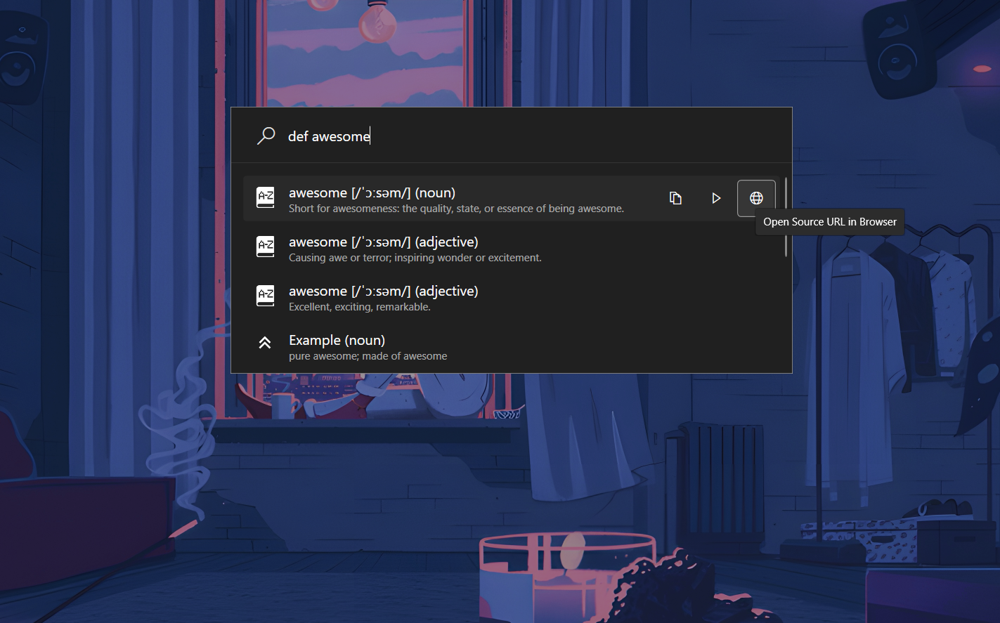
    <figcaption>
      <strong>Wiktionary Integration</strong> - Access comprehensive word information by opening any word in Wiktionary directly from the context menu. Get access to additional meanings, translations, etymologies, and related terms.
    </figcaption>
  </figure>
  
  <figure>
    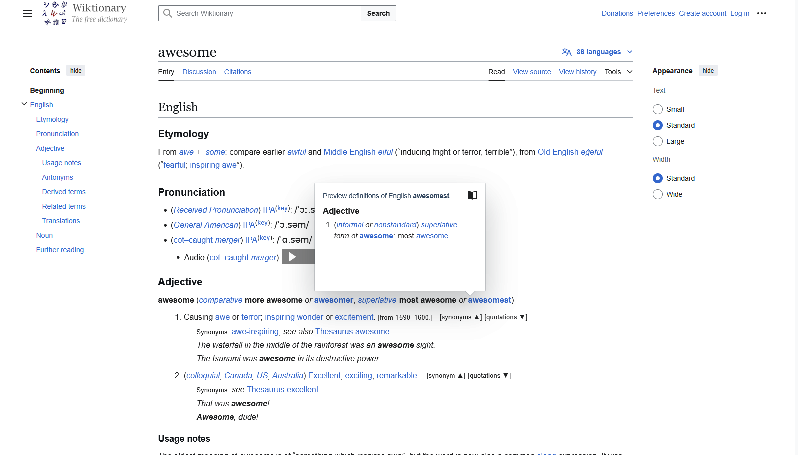
    <figcaption><strong>Rich Context Menu</strong> - The plugin offers a powerful context menu with multiple actions. 
      Copy definitions, play pronunciation audio, open source URLs, and search for related words. 
      Right-click on any result to access these features.
    </figcaption>
  </figure>
</div>

## 🧑‍💻 Tech Stack

| Technology | Description |
|---|---|
| C# / .NET 9.0 | Primary language and runtime |
| PowerToys Run API | IPlugin, IDelayedExecutionPlugin, IContextMenu interfaces |
| HttpClient | API requests with timeout handling |
| System.Text.Json | JSON parsing |
| WPF MediaPlayer | Audio playback |
| System.Threading | Asynchronous operations |
| GitHub Actions | CI/CD with multi-architecture builds |

## 🌐 Localization

Currently, the plugin UI is in English. Localization support is planned for future releases.

## 📸 Screenshots

<div style="display:flex;flex-wrap:wrap;justify-content:center;gap:20px;">
  <figure style="margin:0;">
    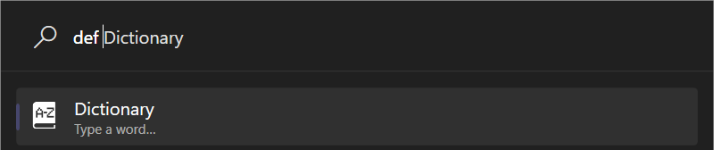
    <figcaption style="text-align:center;">Word Definition</figcaption>
  </figure>
  <figure style="margin:0;">
    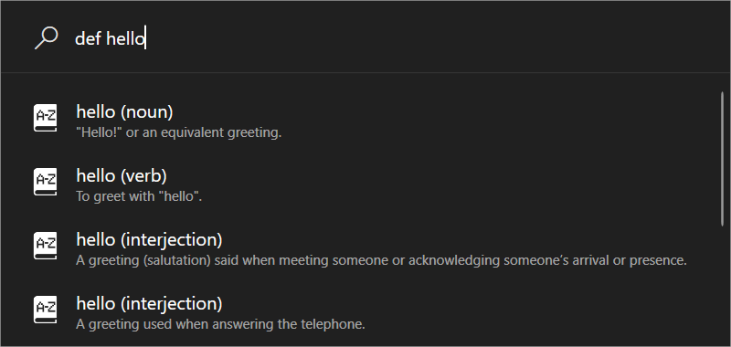
    <figcaption style="text-align:center;">Phonetics Display</figcaption>
  </figure>
  <figure style="margin:0;">
    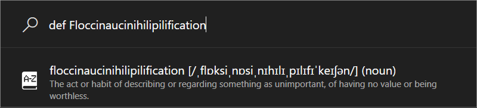
    <figcaption style="text-align:center;">Context Menu</figcaption>
  </figure>
  <figure style="margin:0;">
    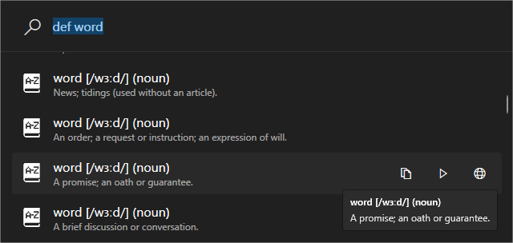
    <figcaption style="text-align:center;">Antonyms Feature</figcaption>
  </figure>
  <figure style="margin:0;">
    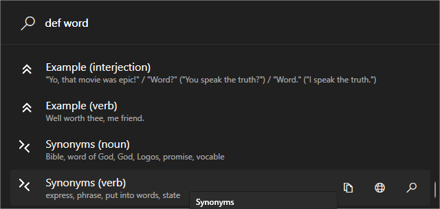
    <figcaption style="text-align:center;">Audio Pronunciation</figcaption>
  </figure>
  <figure style="margin:0;">
    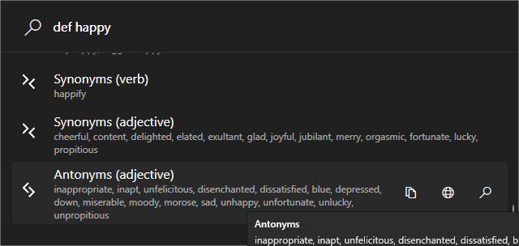
    <figcaption style="text-align:center;">Delayed Execution</figcaption>
  </figure>
</div>

## 📄 License

This project is licensed under the MIT License - see the [LICENSE](LICENSE) file for details.

## 🙏 Acknowledgements

- [Microsoft PowerToys](https://github.com/microsoft/PowerToys) team for the amazing launcher
- [dictionaryapi.dev](https://dictionaryapi.dev/) for providing the free dictionary API
- [Wiktionary](https://en.wiktionary.org/) for comprehensive word information and translations
- All contributors who have helped improve this plugin

## ☕ Support

If you find this plugin useful and would like to support its development, you can buy me a coffee:

[](https://ruslanlap.github.io/ruslanlap_buymeacoffe/)

## 🆕 What's New (v1.0.1)

- 🐞 **Fixed CS0246 error** — Added `using ManagedCommon;` for proper Theme type resolution
- 🪄 **Fixed PowerToys Run window behavior** — Window now stays open when playing pronunciation audio
- 🏗️ **Major code refactoring** — Separated utility classes into individual files for better maintainability:
  - `IconManager.cs` — Theme-aware icon management
  - `AudioManager.cs` — Audio playback functionality  
  - `ClipboardHelper.cs` — Clipboard operations
  - `UrlHelper.cs` — URL handling utilities
  - `TextHelper.cs` — Text processing utilities
  - `ResultProcessor.cs` — Dictionary result processing
  - `ContextMenuBuilder.cs` — Context menu creation
  - `Models.cs` — Data models and extensions
- 📦 **Reduced Main.cs complexity** — Cleaner, more focused main plugin class
- 🧩 **Better separation of concerns** — Each component has a single responsibility
- 🔧 **PTRUN Compliance improvements** — Fixed naming conventions and packaging issues

---

<div align="center">
  <sub>Made with ❤️ by <a href="https://github.com/ruslanlap">ruslanlap</a></sub>
</div>
