# 🔍 PowerToys Run: Definition Plugin

<div align="center">
  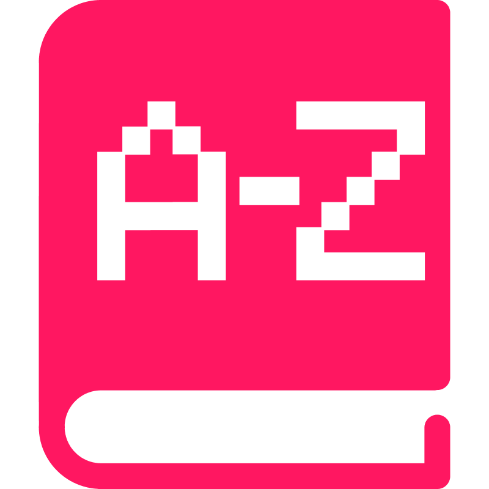
</div>

<div align="center">
  <h1>Definition</h1>
  <p>Lookup word definitions, phonetics, and synonyms directly in PowerToys Run.</p>
  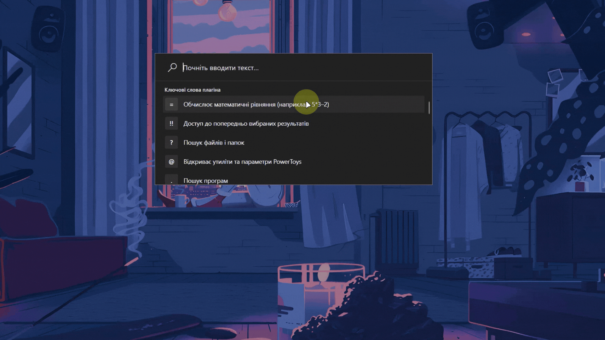
</div>

<div align="center">
  <!-- Badges -->
  <a href="https://github.com/ruslanlap/PowerToysRun-Definition/actions/workflows/build-and-release.yml">
    
  </a>
  <a href="https://github.com/ruslanlap/PowerToysRun-Definition/releases/latest">
    
  </a>
  
  <a href="https://github.com/ruslanlap/PowerToysRun-Definition/stargazers">
    
  </a>
  <a href="https://github.com/ruslanlap/PowerToysRun-Definition/issues">
    
  </a>
  <a href="https://opensource.org/licenses/MIT">
    
      
  
          <a href="https://github.com/hlaueriksson/awesome-powertoys-run-plugins">
    
  </a>
  <a href="https://winstall.app/apps/ruslanlap.DefinitionForCommandPalette">
    
  </a>


</div>

<div align="center">
  <a href="https://github.com/ruslanlap/PowerToysRun-Definition/releases/download/v1.3.2/Definition-1.3.2-x64.zip">
    
  </a>
  <a href="https://github.com/ruslanlap/PowerToysRun-Definition/releases/download/v1.3.2/Definition-1.3.2-ARM64.zip">
    
  </a>
    <a href="https://github.com/ruslanlap/PowerToysRun-Definition/releases/latest">
    
  </a>
</div>

## 📋 Table of Contents

- [📋 Overview](#-overview)
- [✨ Features](#-features)
- [🎬 Demo](#-demo)
- [🚀 Installation](#-installation)
- [🔧 Usage](#-usage)
- [⚙️ Configuration](#️-configuration)
- [📁 Data Storage](#-data-storage)
- [🛠️ Building from Source](#️-building-from-source)
- [📊 Project Structure](#-project-structure)
- [🤝 Contributing](#-contributing)
- [❓ FAQ](#-faq)
- [🧑‍💻 Tech Stack](#-tech-stack)
- [🌐 Localization](#-localization)
- [📸 Screenshots](#-screenshots)
- [📄 License](#-license)
- [🙏 Acknowledgements](#-acknowledgements)
- [☕ Support](#-support)
- [🆕 What's New (v1.3.2)](#-whats-new-v132)
- [🆕 What's New (v1.3.1)](#-whats-new-v131)

## 🆕 What's New (v1.3.2)
+
+- 🏮 **Offline Chinese Dictionary** — Switched from unreliable web scraping to an embedded **CC-CEDICT** database (~124,000 entries).
+- ⚡ **Instant Lookups** — Chinese results are now served instantly from memory without any network requests.
+- 🛡️ **Improved Reliability** — Eliminated "No definitions found" errors caused by MDBG.net's request blocking or layout changes.
+- 📦 **Optimized Assets** — Compressed dictionary data into an embedded resource for an efficient distribution.
+
+## 🆕 What's New (v1.3.1)

- 🩹 **Fixed Chinese Dictionary Selectors** — Resolved an issue where Chinese lookups returned "No definitions found" by correcting HTML scraping selectors.
- 🇨🇳 **Chinese Dictionary Support** — Added support for Chinese-English lookups using MDBG.net (CC-CEDICT data).
- 🔄 **Three-Language Parallel Lookup** — Simultaneously fetch results from English, Ukrainian, and Chinese sources.
- 🎯 **Enhanced Smart Prioritization** — Results are automatically prioritized based on query script (Latin, Cyrillic, or Chinese characters).
- 📦 **Improved Web Scraping** — Leverages HtmlAgilityPack for robust HTML parsing of both Ukrainian and Chinese dictionary sources.

## 🆕 What's New (v1.3.0)
- 🇨🇳 **Chinese Dictionary Support** — Added support for Chinese-English lookups using MDBG.net (CC-CEDICT data).
- 🔄 **Three-Language Parallel Lookup** — Simultaneously fetch results from English, Ukrainian, and Chinese sources.
- 🎯 **Enhanced Smart Prioritization** — Results are automatically prioritized based on query script (Latin, Cyrillic, or Chinese characters).
- 📦 **Improved Web Scraping** — Leverages HtmlAgilityPack for robust HTML parsing of both Ukrainian and Chinese dictionary sources.

## 🆕 What's New (v1.2.2)

- 🇺🇦 **Ukrainian Dictionary Support** — Integrated with `sum.in.ua` explanatory dictionary.
- 🇨🇳 **Chinese Dictionary Support** — Integrated with `MDBG.net` (CC-CEDICT data) for Chinese-English lookups.
- 🔄 **Parallel Lookup** — Simultaneously fetch results from English, Ukrainian, and Chinese sources.
- 🎯 **Smart Prioritization** — Results are automatically prioritized based on the query script (Cyrillic, Chinese, or Latin).
- 🏗️ **Improved Architecture** — Refactored to a provider-based system for better extensibility.
- 🩹 **Better Reliability** — Enhanced error handling ensures one failed provider doesn't break the entire search.

## 📋 Overview

Definition is a plugin for [Microsoft PowerToys Run](https://github.com/microsoft/PowerToys) that allows you to quickly lookup word definitions, phonetics, and synonyms without leaving your keyboard. Simply type `def <word>` to fetch definitions. The plugin supports **English**, **Ukrainian (Українська)**, and **Chinese (中文)** with automatic script detection — just type a word in any supported language and the plugin will prioritize results accordingly.

<div align="center">
  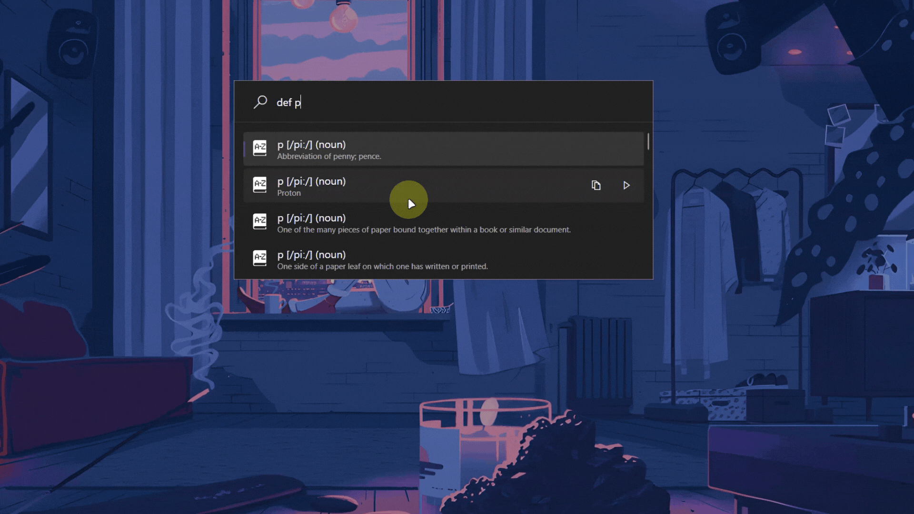
</div>

## ✨ Features

- 🔍 **Instant Definitions**: Get definitions in real-time via `dictionaryapi.dev`.
- 🇺🇦 **Ukrainian Dictionary (Українська)**: Lookup Ukrainian words using [goroh.pp.ua](https://goroh.pp.ua/) (500,000+ words) with [sum.in.ua](https://sum.in.ua/) as fallback — just type any word in Cyrillic (e.g. `def слово`).
- 🇨🇳 **Chinese Dictionary (中文)**: Offline Chinese-English lookups powered by the embedded CC-CEDICT database (~124,000 entries) — no network needed.
- 🔄 **Three-Language Parallel Lookup**: All providers are queried simultaneously; results are prioritized based on your query script (Latin, Cyrillic, or Chinese characters).
- 🔊 **Pronunciation Audio**: Play phonetic audio directly from your results.
- 📚 **Phonetics & Synonyms**: View phonetic spelling, synonyms, and antonyms.
- 📝 **Usage Examples**: See real-world examples of how words are used.
- ⚙️ **Fully Configurable**: JSON-based configuration with 15+ customizable settings.
- ⏱️ **Delayed Execution**: Shows loading indicator before fetching results.
- 💾 **Smart Caching**: In-memory cache for repeat lookups with configurable size and expiration.
- 🔄 **Robust Network Handling**: Exponential backoff retry logic for reliable API calls.
- 🌓 **Theme Awareness**: Automatically switches icons for light/dark mode.
- 📋 **Rich Context Menu**: Copy definitions, play pronunciation, open source URL, or search for related words.
- 🔄 **Cancellable Requests**: Automatically cancels previous requests when typing new queries.
- 🌐 **Wiktionary Integration**: Open any word in Wiktionary for additional information and translations.

## 🎬 Demo

<div align="center">
  
</div>

## 🚀 Installation

### Prerequisites

- [PowerToys Run](https://github.com/microsoft/PowerToys/releases) installed (v0.70.0 or later)
- Windows 10 (build 22621) or later
- .NET 9.0 Runtime (included with Windows 11 22H2 or later)
- Internet connection (for API access)

### Install via WinGet

> **WinGet** is Microsoft's official package manager for Windows 10/11. It's like `apt` for Ubuntu or `brew` for macOS - a command-line tool that installs, updates, and manages software automatically.

**Why use WinGet?**
- ⚡ **One command** — No need to download ZIP files manually
- 🔄 **Auto-updates** — Get notified when new versions are available
- 🛡️ **Trusted source** — Packages are verified and digitally signed
- 🧹 **Clean uninstall** — Removes all files and registry entries properly

```powershell
winget install ruslanlap.DefinitionForCommandPalette
```

**Prerequisites for WinGet:**
- Windows 10 version 1709 (build 16299) or later
- [WinGet client](https://docs.microsoft.com/en-us/windows/package-manager/winget/) (pre-installed on Windows 11, or install from Microsoft Store/App Installer)

### Quick Install (Manual)

1. Download the appropriate ZIP for your system architecture:
   - [x64 version](https://github.com/ruslanlap/PowerToysRun-Definition/releases/download/v1.3.2/Definition-1.3.2-x64.zip)
   - [ARM64 version](https://github.com/ruslanlap/PowerToysRun-Definition/releases/download/v1.3.2/Definition-1.3.2-ARM64.zip)

2. Extract the ZIP to:
   ```
   %LOCALAPPDATA%\Microsoft\PowerToys\PowerToys Run\Plugins\
   ```
   
   Typical path: `C:\Users\YourUsername\AppData\Local\Microsoft\PowerToys\PowerToys Run\Plugins\`

3. Restart PowerToys (right-click the PowerToys icon in the system tray and select "Restart").

4. Open PowerToys Run (`Alt + Space`) and type `def <word>`.

### Manual Verification

To verify the plugin is correctly installed:

1. Open PowerToys Settings
2. Navigate to PowerToys Run > Plugins
3. Look for "Definition" in the list of plugins
4. Ensure it's enabled (toggle should be ON)

## 🔧 Usage

1. Activate PowerToys Run (`Alt + Space`).
2. Type:
   - `def` to see instructions.
   - `def <word>` to lookup definitions.
3. Press <kbd>Enter</kbd> to fetch results.
4. Use <kbd>Ctrl + C</kbd> to copy a definition.
5. Right-click a result to:
   - Copy definition with <kbd>Ctrl + C</kbd>
   - Play pronunciation audio
   - Open the word in Wiktionary
   - Search for related words

## ⚙️ Configuration

The plugin supports extensive customization through a `config.json` file that's automatically created in the plugin directory. Changes take effect immediately without requiring a restart.

### Available Settings

| Setting | Default | Description |
|---------|---------|-------------|
| `Language` | `"en"` | Default language (`"en"`, `"uk"`, or `"zh"`) |
| `ApiEndpoint` | `https://api.dictionaryapi.dev/api/v2/entries/en/` | English dictionary API endpoint |
| `UkrainianApiEndpoint` | `https://sum.in.ua/s/` | Ukrainian dictionary fallback endpoint (sum.in.ua) |
| `ChineseApiEndpoint` | `https://www.mdbg.net/chinese/dictionary?...` | Chinese dictionary reference URL |
| `CacheMaxSize` | 100 | Maximum number of cached word lookups |
| `HttpTimeoutSeconds` | 10 | Timeout for API requests in seconds |
| `CacheExpirationMinutes` | 30 | How long to keep cache entries |
| `EnableAudioPlayback` | true | Enable/disable pronunciation audio |
| `EnableClipboardOperations` | true | Enable/disable copy to clipboard |
| `TextTruncateLength` | 30 | Maximum text length in context menu |
| `EnableVerboseLogging` | false | Enable detailed debug logging |
| `MaxResultsPerMeaning` | 3 | Maximum definitions per word meaning |
| `ShowExamplesInResults` | true | Show usage examples |
| `ShowSynonymsInResults` | true | Show synonyms |
| `ShowAntonymsInResults` | true | Show antonyms |

### Example Configuration

```json
{
  "Language": "en",
  "CacheMaxSize": 200,
  "HttpTimeoutSeconds": 15,
  "EnableAudioPlayback": true,
  "ShowSynonymsInResults": false,
  "ShowAntonymsInResults": false,
  "ShowExamplesInResults": true,
  "MaxResultsPerMeaning": 2,
  "EnableVerboseLogging": true
}
```

> **Note:** You don't need to change `Language` to use Ukrainian or Chinese. The plugin queries all three providers in parallel and automatically detects the script of your query. Cyrillic input (e.g. `def слово`) will prioritize Ukrainian results, Chinese characters will prioritize Chinese results, and Latin input will prioritize English results.

## 📁 Data Storage

All settings are stored in the standard PowerToys settings file (no additional data files created).

## 🛠️ Building from Source

```bash
git clone https://github.com/ruslanlap/PowerToysRun-Definition.git
cd PowerToysRun-Definition/Definition
dotnet build
# To package:
dotnet publish -c Release -r win-x64 --output ./publish
zip -r Definition-v1.3.1-x64.zip ./publish
```

## 📊 Project Structure

```
PowerToysRun-Definition/
├── data/                            # Plugin assets (icons, demos)
│   ├── definition.dark.png
│   ├── definition.logo.png
│   ├── demo-definition.gif
│   └── demo-definition-2.gif
├── Definition/                      # Plugin source
│   ├── Community.PowerToys.Run.Plugin.Definition/
│   │   ├── Images/
│   │   │   ├── definition.dark.png
│   │   │   └── definition.light.png
│   │   ├── Main.cs
│   │   └── plugin.json
│   └── Community.PowerToys.Run.Plugin.Definition.csproj
└── README.md
```

## 🤝 Contributing

Contributions are welcome! Here's how you can help:

1. Fork the repository
2. Create a feature branch: `git checkout -b feature/amazing-feature`
3. Commit your changes: `git commit -m 'Add amazing feature'`
4. Push to the branch: `git push origin feature/amazing-feature`
5. Open a Pull Request

Please make sure to update tests as appropriate.

### Contributors

- [ruslanlap](https://github.com/ruslanlap) - Project creator and maintainer

## ❓ FAQ

<details>
<summary><b>Does the plugin require internet access?</b></summary>
<p>English and Ukrainian lookups require internet access (dictionaryapi.dev and goroh.pp.ua respectively). Chinese lookups use an embedded offline dictionary and work without internet. All results are cached in memory for subsequent lookups.</p>
</details>

<details>
<summary><b>How do I change the plugin's theme?</b></summary>
<p>The plugin automatically adapts to your PowerToys theme (light/dark). Icons are dynamically loaded based on your current system theme.</p>
</details>

<details>
<summary><b>Are definitions cached?</b></summary>
<p>Yes, definitions are cached in memory during the current session (up to 100 entries) to improve performance and reduce API calls.</p>
</details>

<details>
<summary><b>Can I customize the dictionary source?</b></summary>
<p>Yes. You can change <code>ApiEndpoint</code> (English) and <code>UkrainianApiEndpoint</code> (Ukrainian) in <code>config.json</code>. Chinese lookups use the embedded CC-CEDICT database.</p>
</details>

<details>
<summary><b>How do I look up Ukrainian words?</b></summary>
<p>Just type <code>def слово</code> (any Ukrainian word in Cyrillic). The plugin automatically detects Cyrillic script and prioritizes Ukrainian results. The primary source is <a href="https://goroh.pp.ua/">goroh.pp.ua</a> (Горох — українські словники, 500,000+ words) with <a href="https://sum.in.ua/">sum.in.ua</a> as fallback. No special API key is needed.</p>
</details>

<details>
<summary><b>Which languages are supported?</b></summary>
<p>Three languages are supported out of the box:</p>
<ul>
<li><strong>English</strong> — via <a href="https://dictionaryapi.dev/">dictionaryapi.dev</a> (free REST API)</li>
<li><strong>Ukrainian (Українська)</strong> — via <a href="https://goroh.pp.ua/">goroh.pp.ua</a> (primary) + <a href="https://sum.in.ua/">sum.in.ua</a> (fallback)</li>
<li><strong>Chinese (中文)</strong> — via embedded CC-CEDICT database (~124,000 entries, fully offline)</li>
</ul>
</details>

<details>
<summary><b>Why does the plugin show "Looking up..." before showing results?</b></summary>
<p>The plugin implements IDelayedExecutionPlugin which shows a loading indicator while fetching results from the API. This provides immediate feedback while the request is processing.</p>
</details>

<details>
<summary><b>How do I play the pronunciation audio?</b></summary>
<p>Right-click on any definition result and select "Play Pronunciation" from the context menu (only available if the API provides audio for that word).</p>
</details>

<details>
<summary><b>How can I see more information about a word?</b></summary>
<p>Right-click on any result and select "Open Source URL in Browser" to view the word in Wiktionary, which provides additional information, translations, and etymology.</p>
</details>

<details>
<summary><b>What's the difference between WinGet and manual installation?</b></summary>
<p><strong>WinGet installation:</strong> Run one command (<code>winget install ruslanlap.DefinitionForCommandPalette</code>) and WinGet handles everything - downloads, verifies, installs, and registers the extension automatically. You also get automatic update notifications when new versions are released.</p>
<p><strong>Manual installation:</strong> Download ZIP file, extract to specific folder, restart PowerToys. You need to check for updates manually on GitHub.</p>
<p>WinGet is recommended for most users as it's more convenient and ensures you always have the latest version.</p>
</details>

## 🔆 Feature Spotlight

This section highlights some of the most powerful features of the Definition plugin:

<div align="center">
  <figure>
    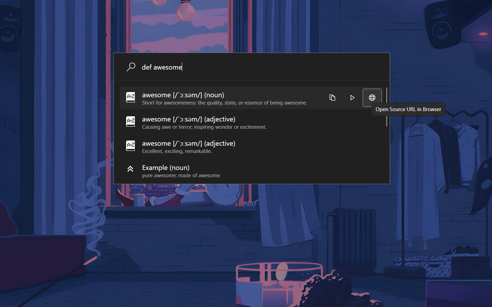
    <figcaption>
      <strong>Wiktionary Integration</strong> - Access comprehensive word information by opening any word in Wiktionary directly from the context menu. Get access to additional meanings, translations, etymologies, and related terms.
    </figcaption>
  </figure>
  
  <figure>
    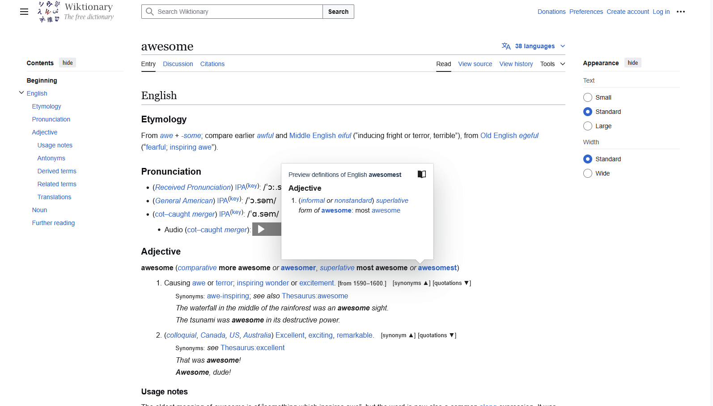
    <figcaption><strong>Rich Context Menu</strong> - The plugin offers a powerful context menu with multiple actions. 
      Copy definitions, play pronunciation audio, open source URLs, and search for related words. 
      Right-click on any result to access these features.
    </figcaption>
  </figure>
</div>

## 🧑‍💻 Tech Stack

| Technology | Description |
|---|---|
| C# / .NET 9.0 | Primary language and runtime |
| PowerToys Run API | IPlugin, IDelayedExecutionPlugin, IContextMenu interfaces |
| HttpClient | API requests with timeout handling |
| System.Text.Json | JSON parsing |
| WPF MediaPlayer | Audio playback |
| System.Threading | Asynchronous operations |
| GitHub Actions | CI/CD with multi-architecture builds |

## 🌐 Supported Languages

The plugin supports three dictionary sources with automatic script detection:

| Language | Source | Method | Internet Required |
|----------|--------|--------|:-----------------:|
| **English** | [dictionaryapi.dev](https://dictionaryapi.dev/) | REST API (JSON) | Yes |
| **Українська** | [goroh.pp.ua](https://goroh.pp.ua/) (primary) + [sum.in.ua](https://sum.in.ua/) (fallback) | HTML scraping | Yes |
| **中文** | CC-CEDICT (embedded, ~124,000 entries) | Offline database | No |

**How it works:** When you type `def <word>`, all three providers are queried in parallel. The plugin detects the script of your input and boosts scores for matching results:
- Cyrillic input (`def слово`) → Ukrainian results prioritized
- Chinese characters (`def 你好`) → Chinese results prioritized
- Latin input (`def hello`) → English results prioritized

> **Note on Ukrainian:** There is no public REST API for Ukrainian dictionaries. The plugin uses [goroh.pp.ua](https://goroh.pp.ua/) (Горох — українські словники) as the primary source — a comprehensive Ukrainian dictionary with 500,000+ words, definitions, examples, synonyms, and more. Cyrillic words are used directly in the URL (e.g. `def слово` → `https://goroh.pp.ua/Тлумачення/слово`). If goroh.pp.ua is unavailable, [sum.in.ua](https://sum.in.ua/) is used as fallback.

## 📸 Screenshots

<div style="display:flex;flex-wrap:wrap;justify-content:center;gap:20px;">
  <figure style="margin:0;">
    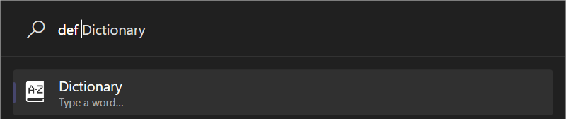
    <figcaption style="text-align:center;">Word Definition</figcaption>
  </figure>
  <figure style="margin:0;">
    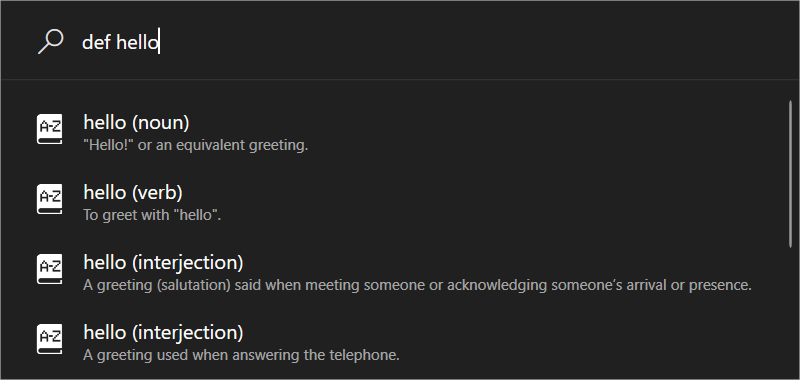
    <figcaption style="text-align:center;">Phonetics Display</figcaption>
  </figure>
  <figure style="margin:0;">
    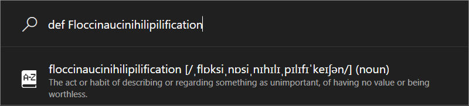
    <figcaption style="text-align:center;">Context Menu</figcaption>
  </figure>
  <figure style="margin:0;">
    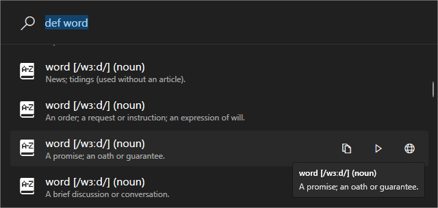
    <figcaption style="text-align:center;">Antonyms Feature</figcaption>
  </figure>
  <figure style="margin:0;">
    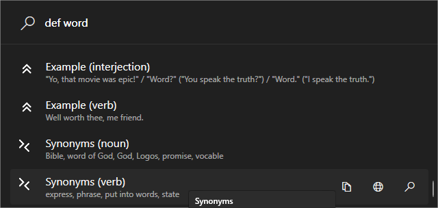
    <figcaption style="text-align:center;">Audio Pronunciation</figcaption>
  </figure>
  <figure style="margin:0;">
    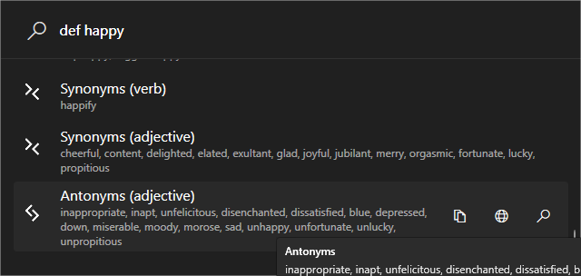
    <figcaption style="text-align:center;">Delayed Execution</figcaption>
  </figure>
</div>

## 📄 License

This project is licensed under the MIT License - see the [LICENSE](LICENSE) file for details.

## 🙏 Acknowledgements

- [Microsoft PowerToys](https://github.com/microsoft/PowerToys) team for the amazing launcher
- [dictionaryapi.dev](https://dictionaryapi.dev/) for providing the free English dictionary API
- [goroh.pp.ua](https://goroh.pp.ua/) for Горох — українські словники (primary Ukrainian dictionary source)
- [sum.in.ua](https://sum.in.ua/) for the Словник української мови (Ukrainian dictionary fallback)
- [MDBG.net](https://www.mdbg.net) for providing access to CC-CEDICT Chinese-English dictionary
- [Wiktionary](https://en.wiktionary.org/) for comprehensive word information and translations
- All contributors who have helped improve this plugin

## ☕ Support

If you find this plugin useful and would like to support its development, you can buy me a coffee:

[](https://ruslanlap.github.io/ruslanlap_buymeacoffe/)

## 🆕 What's New (v1.2.2)

- 🇺🇦 **Ukrainian Dictionary Support** — Integrated with `sum.in.ua` explanatory dictionary.
- 🇨🇳 **Chinese Dictionary Support** — Integrated with `MDBG.net` (CC-CEDICT data) for Chinese-English lookups.
- 🔄 **Parallel Lookup** — Simultaneously fetch results from English, Ukrainian, and Chinese sources.
- 🎯 **Smart Prioritization** — Results are automatically prioritized based on the query script (Cyrillic, Chinese, or Latin).
- 🏗️ **Improved Architecture** — Refactored to a provider-based system for better extensibility.
- 🩹 **Better Reliability** — Enhanced error handling ensures one failed provider doesn't break the entire search.
- 📦 **Dependencies** — Added `HtmlAgilityPack` for robust HTML parsing of Ukrainian and Chinese results.

## 🆕 What's New (v1.2.1)

- ⚙️ **Fully Configurable Settings** — JSON-based configuration system with runtime updates:
  - `config.json` with 11 customizable settings
  - Toggle synonyms, antonyms, examples display
  - Configure cache size, timeouts, and result limits
  - Enable/disable audio playback and clipboard operations
  - Settings reload automatically without restart
- 🔄 **Robust Network Retry Logic** — Enhanced reliability for API calls:
  - Exponential backoff with smart retry conditions
  - Handles transient network errors gracefully
  - Configurable retry attempts and delays
- 🛠️ **Improved Clipboard Operations** — Better threading and reliability:
  - Custom STA task scheduler for thread safety
  - Enhanced error handling and timeout protection
  - Configurable clipboard operations enable/disable
- 🔧 **Configuration Bug Fix** — Settings now actually work:
  - Fixed issue where config.json changes were ignored
  - All configuration options now properly respected
  - Dynamic reloading ensures immediate effect
- 📊 **Enhanced Debugging** — Better troubleshooting capabilities:
  - Verbose logging option for detailed diagnostics
  - Improved error reporting throughout the plugin
  - Better network error categorization

---

<div align="center">
  <sub>Made with ❤️ by <a href="https://github.com/ruslanlap">ruslanlap</a></sub>
</div>
